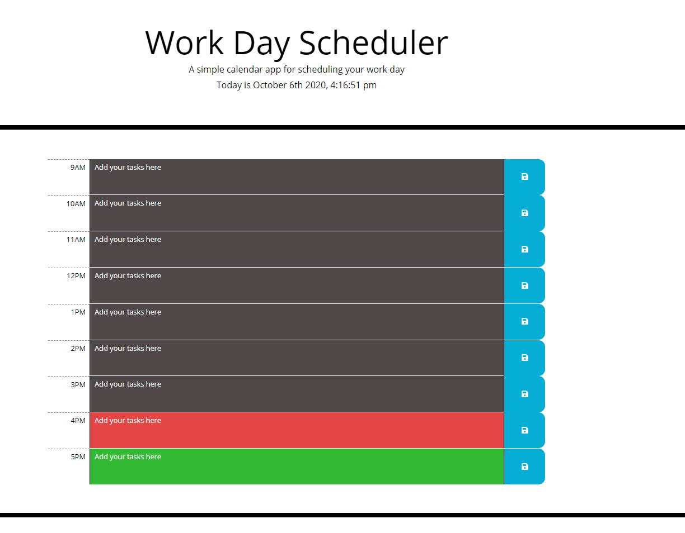

# Work Scheduler
View the [deployed app](https://dawisen.github.io/Work-Scheduler/)

## Description
This project utilizes Moment.js and local storage allowing users to save work tasks in their browser window. When you open the planner the current day is displayed at the top of the calendar. As you scroll down you are presented with time blocks for standard business hours (9am-5pm). The time blocks are color-coded to indicate whether it is in the past (gray), present(red), or future (green). The saved events persist in local storage when you refresh the page

## Table of Contents

* [Installation](#Installation)
* [Usage](#Usage)
* [License](#License)
* [Contributing](#Contributing)
* [Testing](#Testing)
* [Questions](#Questions)

## Installation
While inside the root directory run this command in the terminal
>npm i
  
## Usage
To use the repo, fork it to your github page or clone the repository.

## License

## Contributors
dawisen

## Testing
no tests available
  
## Questions
If you have any questions or issues please contact me via [email](daniellewwise@gmail.com) 
View my other projects [here](https://github.com/dawisen?tab=repositories)
